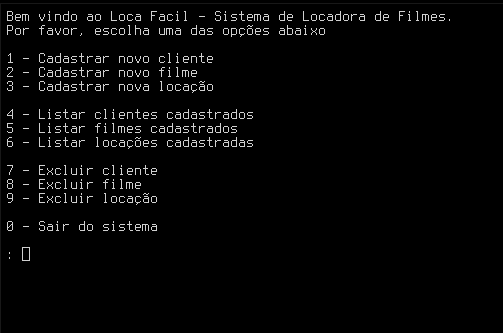

# locadora.c

## Introdução
Loca Fácil ou locadora.c foi o nome dado para uns dos meus primeiros programas feitos em C, como forma de aplicar meus conhecimentos aprendidos na materia de Algoritmos e Lógica de programação na faculdade onde foi ensinado a linguagem C. Este programinha tem as funcionalidades de Cadastrar, Listar e Excluir dados de clientes, filmes e locações.



Para compilar é preciso estar em um sistema Unix e usar o comando 
```gcc -o locadora main.c```
